## Requirements

Before installing the service, ensure the following requirements are met:

- **Installed service**: Either the [executable](../getting-started/installation.md#option-1-ready-to-use-executable) (recommended, no Python needed) or a pip install with a `.venv` — see [Installation](../getting-started/installation.md)
- **Administrator Privileges**: Required for installing and managing Windows services
- **Port Availability**: Ensure the desired port (default: 8020) is not in use by another application

---

## Which Option to Choose?

| Feature | NSSM | FireDaemon | YAJSW |
|---------|------|------------|-------|
| **License** | Free (Public Domain) | Commercial | Free (Apache License) |
| **GUI** | Yes | Yes | No |
| **Requirements** | None | None | Java Runtime |
| **Complexity** | Low | Low | Medium |
| **Best For** | Most users, simple & free | Enterprise GUI management | Java environments, cross-platform |

### Recommendations:

- **NSSM**: **Recommended for most users** — free, lightweight, simple to configure, well-documented, and widely used
- **FireDaemon**: Choose if you have budget for commercial software and prefer comprehensive GUI-based management with advanced features
- **YAJSW**: Choose if you already have Java installed or need cross-platform compatibility (also supports Linux/macOS)

---

## Option 1: NSSM *(Recommended)*

### Installation

1. Open a command prompt (e.g., PowerShell) as Administrator.

2. Configure the service using one of the following methods:

### Method 1: GUI Configuration

1. Run the command `nssm install TestBenchRequirementService`. The GUI will open automatically.
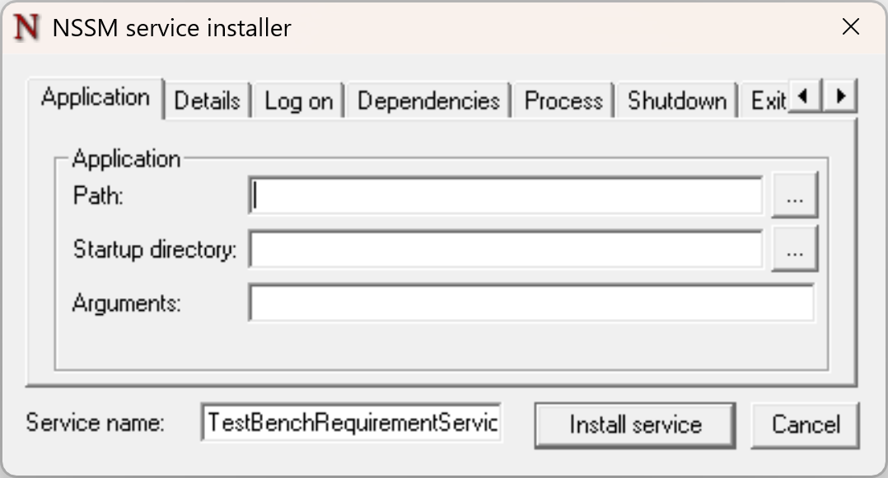

2. Configure the following in the **Application** tab:
   - Path: Path to the Python service executable
     e.g., `E:\Code\requirement-service-python\.venv\Scripts\testbench-requirement-service.exe`
   - Startup directory: Path to the root directory containing configuration files
     e.g., `E:\Code\requirement-service-python\`
   - Arguments: Startup parameters for the Python service
     e.g., `start --port 8011`
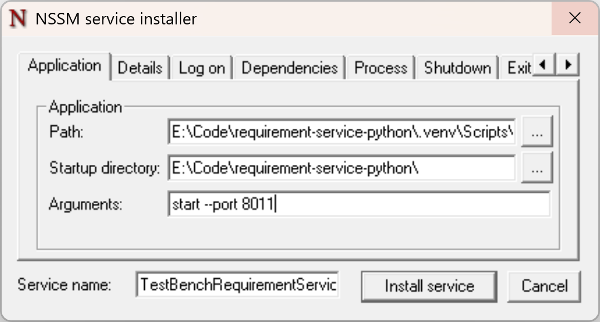

3. Configure the following in the **Details** tab:
   - Display name: `TestBench Requirement Service`
   - Description: `Python-based TestBench Requirement Service`
   - Startup type: `Automatic (Delayed)`
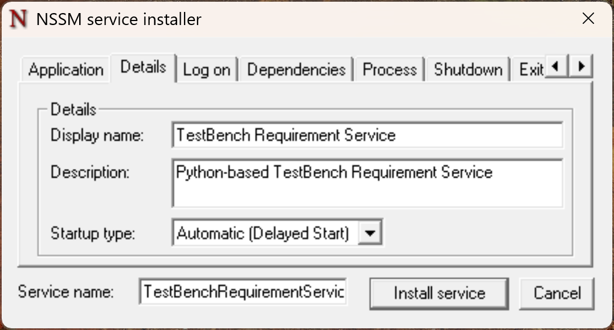

4. **Optional:** In the **Log On** tab, configure the service for specific accounts. Only needed if not using the local system account.

5. **Optional:** In the **Dependencies** tab, configure Windows Service dependencies. Only needed if something must run before the service starts.

6. **Optional:** In the **Process** tab, configure process-related settings such as process priority.

7. **Optional:** In the **Shutdown** tab, specify how the service should handle the Python service shutdown.

8. Configure the following in the **Exit actions** tab:
   - Restart: `Stop Service (oneshot mode)`
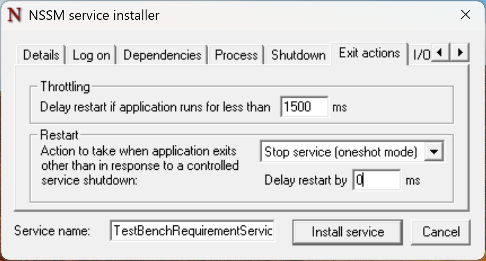

9. Configure the following in the **I/O** tab:
   - Output (stdout): Path to the log file for stdout output
   - Error (stderr): Path to the log file for stderr output
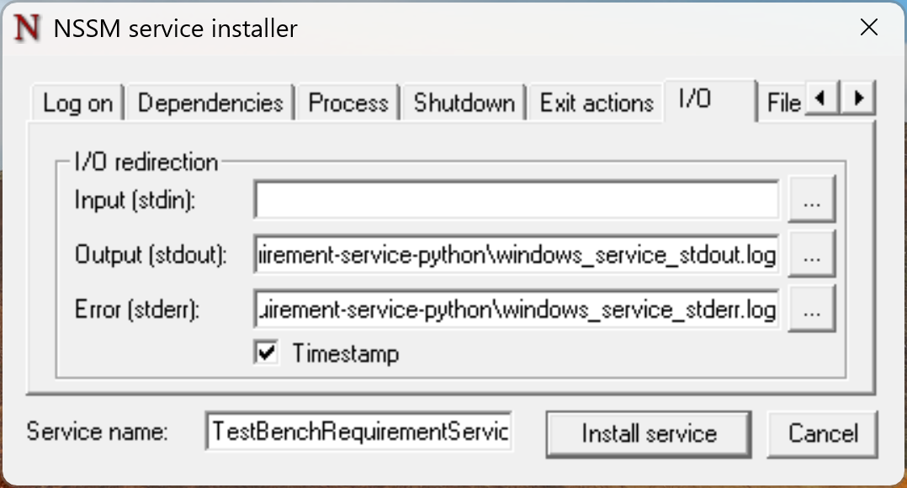

10. **Optional:** In the **File rotation** tab, configure log file rotation.

11. **Optional:** In the **Environment** tab, set environment variables for the service.

12. **Optional:** In the **Hooks** tab, define event hooks such as running a command before service start.

13. After completing all settings, click the "Install Service" button to install the service.


14. A confirmation dialog should appear upon successful installation.
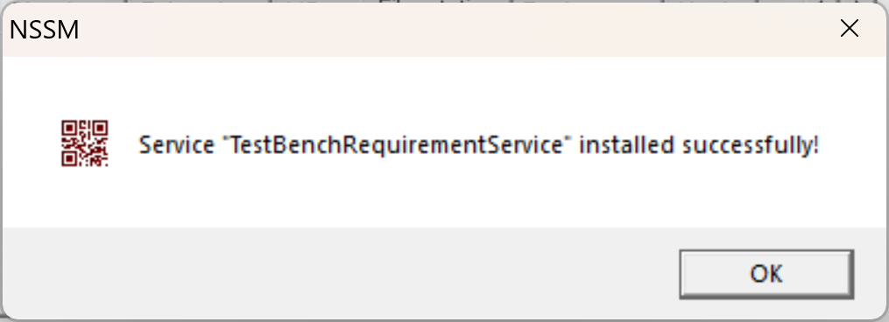

### Method 2: CLI Configuration

1. Install the service directly:
```powershell
nssm install TestBenchRequirementService "E:\Code\requirement-service-python\.venv\Scripts\testbench-requirement-service.exe" "start --port 8011"
```

2. Configure application settings (startup directory):
```powershell
nssm set TestBenchRequirementService AppDirectory "E:\Code\requirement-service-python"
```

3. Configure details settings (display name, description, startup type):
```powershell
nssm set TestBenchRequirementService DisplayName "TestBench Requirement Service"
nssm set TestBenchRequirementService Description "Python-based TestBench Requirement Service"
nssm set TestBenchRequirementService Start SERVICE_DELAYED_AUTO_START
```

4. Configure exit actions (restart behavior):
```powershell
nssm set TestBenchRequirementService AppExit Default StopService
```

5. Configure I/O settings (logging):
```powershell
nssm set TestBenchRequirementService AppStdout "E:\Code\requirement-service-python\logs\stdout.log"
nssm set TestBenchRequirementService AppStderr "E:\Code\requirement-service-python\logs\stderr.log"
nssm set TestBenchRequirementService AppRotateFiles 1
```

### Managing the Service

##### Start service:
```powershell
nssm start TestBenchRequirementService
```

##### Check status:
```powershell
nssm status TestBenchRequirementService
```

##### Edit service:
```powershell
nssm edit TestBenchRequirementService
```

##### Restart service:
```powershell
nssm restart TestBenchRequirementService
```

##### Stop service:
```powershell
nssm stop TestBenchRequirementService
```

##### Remove service:
```powershell
nssm remove TestBenchRequirementService
```

---

## Option 2: FireDaemon

### Installation Steps

1. Open FireDaemon Pro as Administrator.

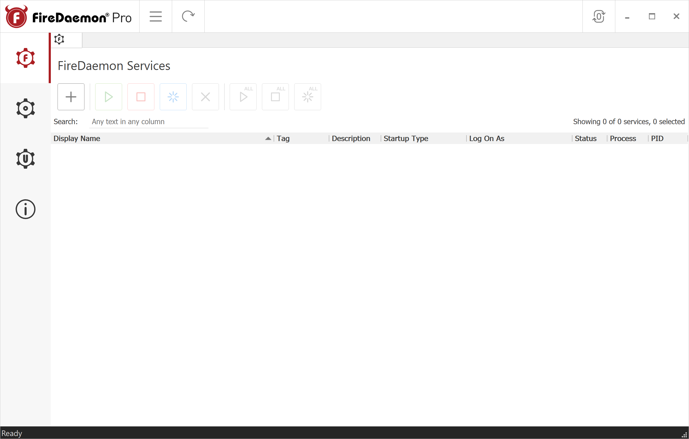

2. Click the Plus icon (New) or press Ctrl+N to create a new service.
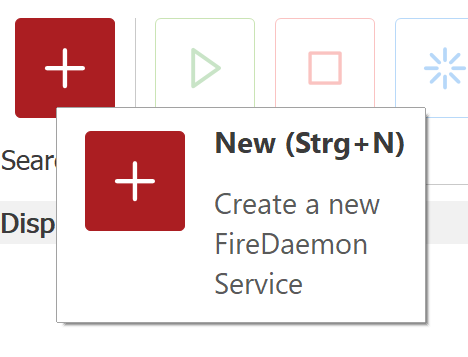
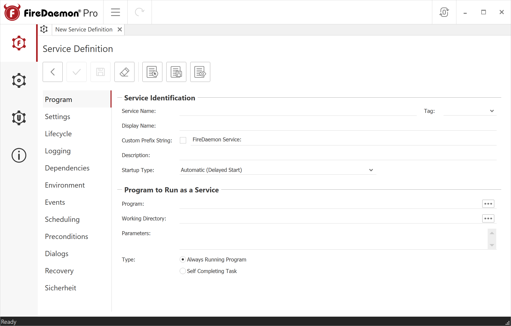

3. Configure the following in the **Program** tab:
   ###### Service Identification:
   - Service Name: `TestBenchRequirementService`
   - Display Name: `TestBench Requirement Service`
   - Custom Prefix String: Enable checkbox and leave field empty
   - Description: `Python-based TestBench Requirement Service`
   - Startup Type: `Automatic (Delayed Start)`
   ###### Program to Run as a Service:
   - Program: Path to the Python service executable
     e.g., `E:\Code\requirement-service-python\.venv\Scripts\testbench-requirement-service.exe`
   - Working Directory: Path to the root directory containing configuration files
     e.g., `E:\Code\requirement-service-python\`
   - Parameters: Startup parameters for the Python service
     e.g., `start --port 8010`
   - Type: `Always Running Program`

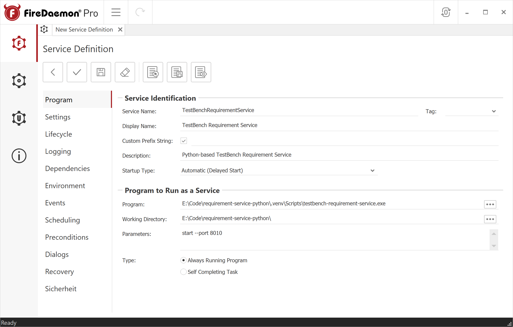

4. Configure the following in the **Settings** tab:
   ###### General:
   - Show Window: `Hidden`
   - Job Type: `Global`
   ###### Logon:
   Configure if a specific account should run the service.

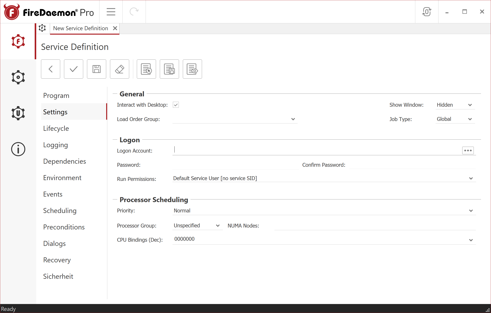

5. Configure the following in the **Lifecycle** tab:
   ###### Lifecycle:
   - Upon Program Exit: `Stop FireDaemon Service`
   - Console Program: `True`
   - Shutdown By: `Ctrl+C` or `Forceful Termination`

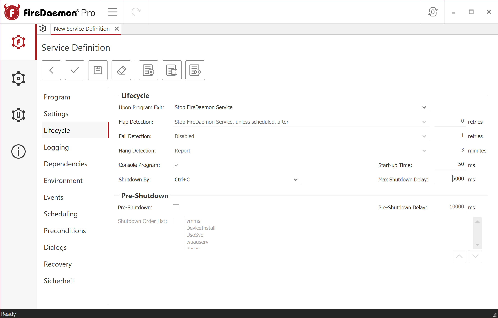

6. Configure the following in the **Logging** tab:
   ###### Output Capture:
   - Capture Stdout in File: Path for stdout logging, e.g., `E:\Code\requirement-service-python\windows_service.log`
   - Capture Stderr in Stdout: `True` or specify a separate path for stderr

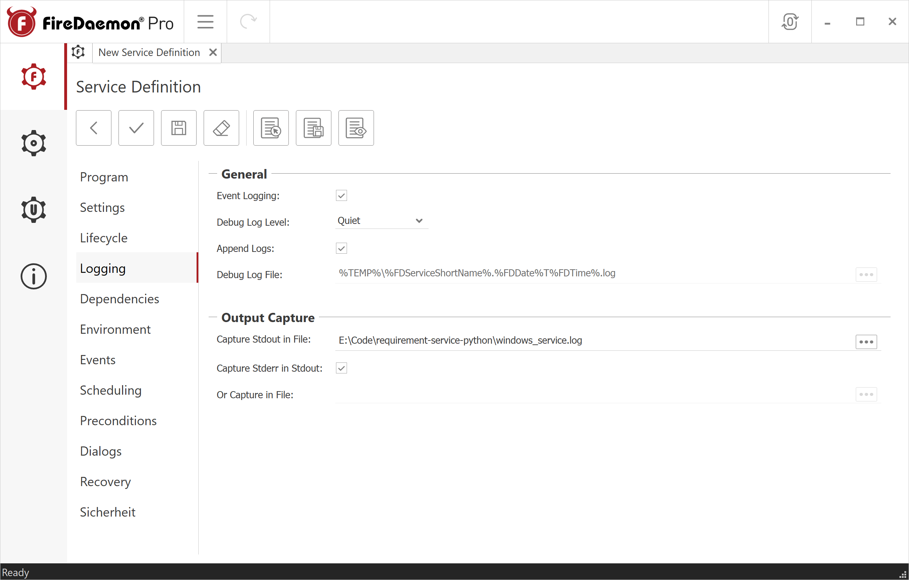

7. **Optional:** In the **Dependencies** tab, configure dependencies to other services.
8. **Optional:** In the **Environment** tab, set environment variables.
9. **Optional:** In the **Events** tab, configure start and termination events.
10. Configure the following in the **Scheduling** tab:
    - Overall Launch Delay: e.g., `60 seconds`

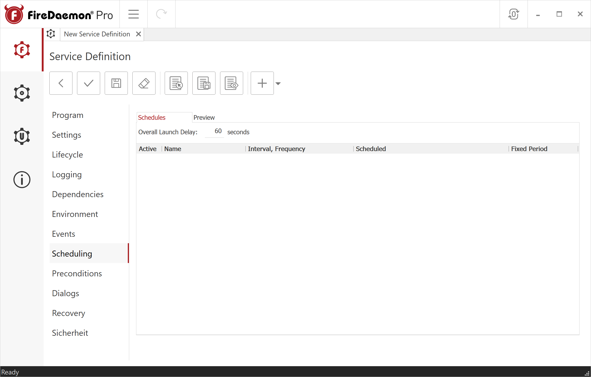

11. Click the checkmark icon to save the settings and close the service definition.

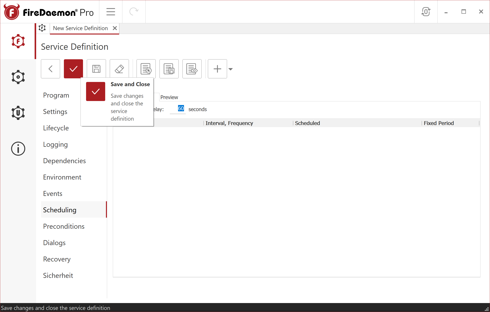

12. Select "TestBench Requirement Service" from the services list and click the Start icon (green play button) to start the service.

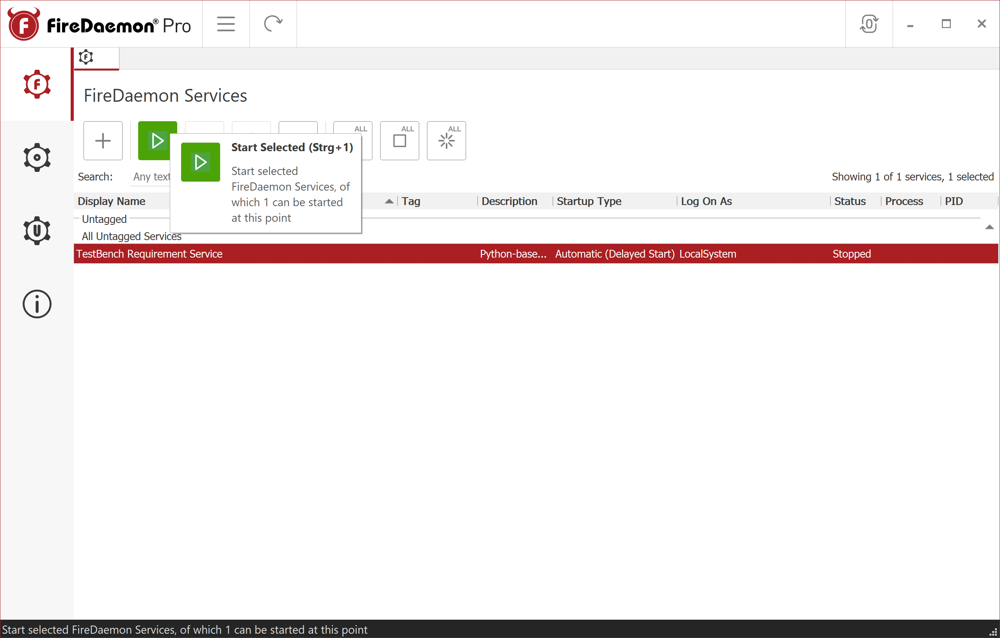

13. The service should now be running.

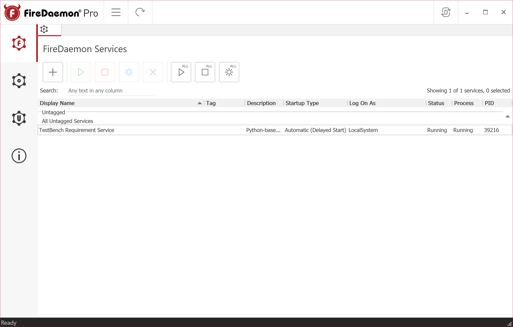

### Managing the Service

First select the service from the services list.

##### Start service:
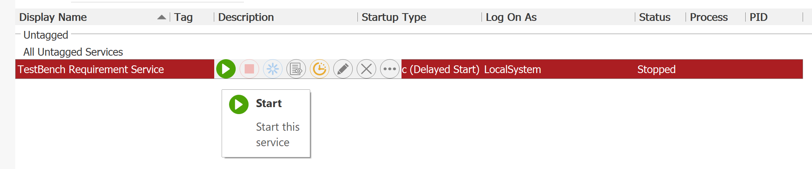

##### Stop service:
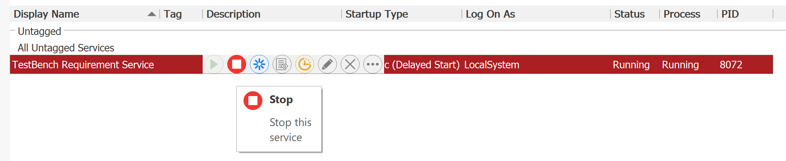

##### Restart service:
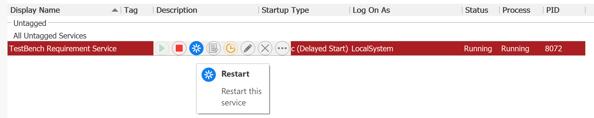

##### Edit service:
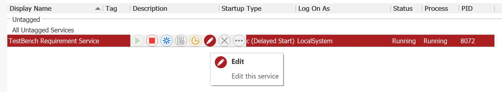

##### Remove service:
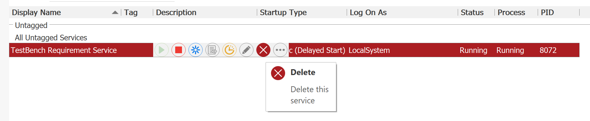

---

## Option 3: YAJSW (Yet Another Java Service Wrapper)

### Installation Steps

1. **Requirements:**
   - YAJSW downloaded and extracted, e.g., to `C:\YAJSW`
   - Java Runtime Environment (JRE) installed
   - Administrator privileges

2. **Configure YAJSW:**
   - Navigate to `<YAJSW_INSTALL_DIR>\conf\` and open (or create) `wrapper.conf`
   - Update the configuration with the following values:

   ```ini
   # Java executable for YAJSW (adjust path to your Java installation)
   wrapper.java.command=C:/Program Files/Eclipse Adoptium/jre-8.0.472.8-hotspot/bin/java.exe

   # Windows Service
   wrapper.ntservice.name=TestBenchRequirementService
   wrapper.ntservice.displayname=TestBench Requirement Service
   wrapper.ntservice.description=Python-based TestBench Requirement Service

   # Python Service (adjust paths to your installation directory)
   wrapper.working.dir=E:/TestBenchRequirementService
   wrapper.image=E:/TestBenchRequirementService/.venv/Scripts/testbench-requirement-service.exe
   wrapper.app.parameter.1=start
   wrapper.app.parameter.2=--port
   wrapper.app.parameter.3=8010

   # Logging
   wrapper.logfile=../log/wrapper.log
   wrapper.logfile.maxsize=10m
   wrapper.logfile.maxfiles=5
   ```

   **Note:** Replace paths with your actual installation directories and Java version.

3. **Test Configuration:**
   - Open Command Prompt as Administrator
   - Navigate to `<YAJSW_INSTALL_DIR>\bat\`
   - Run: `runConsole.bat`
   - Verify the application starts without errors
   - Stop with `Ctrl+C`

4. **Install and Start Service:**
   - Open Command Prompt as Administrator
   - Navigate to `<YAJSW_INSTALL_DIR>\bat\`
   - Install the service: `installService.bat`
   - Start the service: `startService.bat`

### Managing the Service

Open Command Prompt as Administrator and navigate to `<YAJSW_INSTALL_DIR>\bat\`:

##### Start service:
```cmd
startService.bat
```

##### Stop service:
```cmd
stopService.bat
```

##### Remove service:
```cmd
uninstallService.bat
```